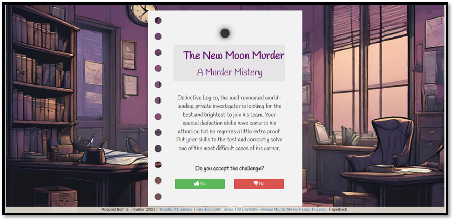
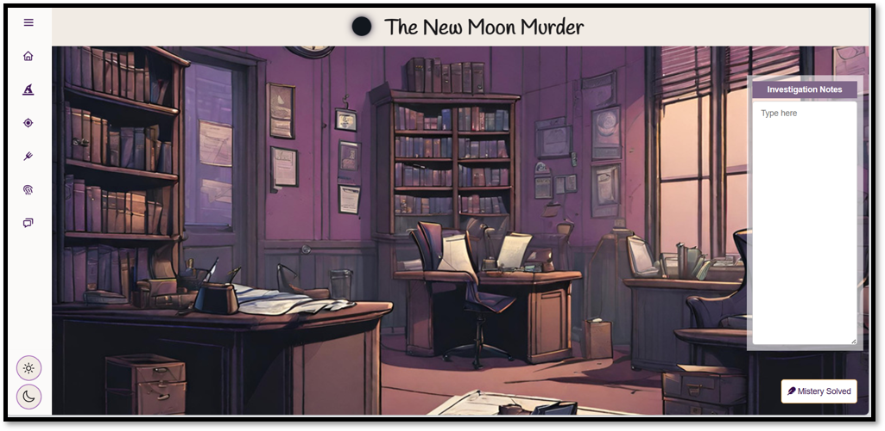
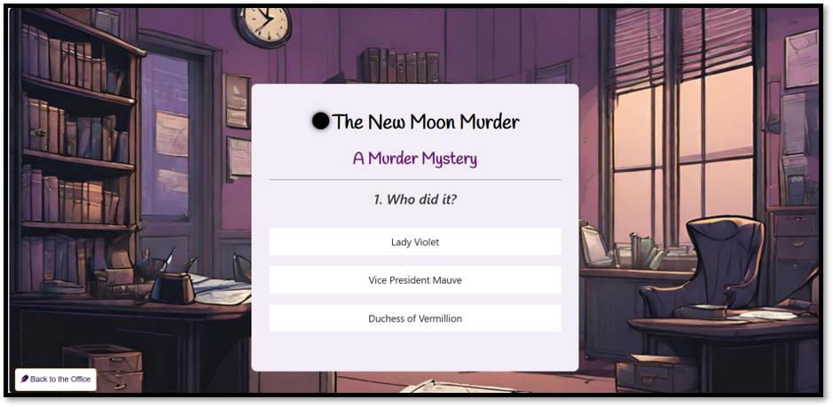

# Murder Mystery

This was my answer to the Into to Web Development Challenge set by Code First Girls and the first website I have developed.
Link to deployed page: https://jpquental90.github.io/Murder-Mystery/

## Description

This is 3-page application which allows the user to play the role of detective, investigating clues and answering the question of who the murderer is in the presented scenario.

## Table of Contents

* [Usage](#usage)
* [Code](#code)
* [Credits](#credits)
* [License](#license)

## Usage

When the user enters the website they will come across an home page with a message challenging them to solve the case.

Upon accepting the challenge, they are taken to the detective's office page, where they have access to different clues and pieces of information they need to solve the case. Once it is done, they can click on the 'Mystery Solved' button on the bottom right corner.

Once the 'Mystery Solved' button is clicked, a quiz page is displayed enabling the user to submit their answers and find out if they are correct.

## Code

This application used HTML, CSS and JavaScript. 

## Credits

I have used Google, YouTube, and various technical websites to research information and used FreeCodeCamp courses to learn the skills I needed.

## License

Licensed under the MIT license.